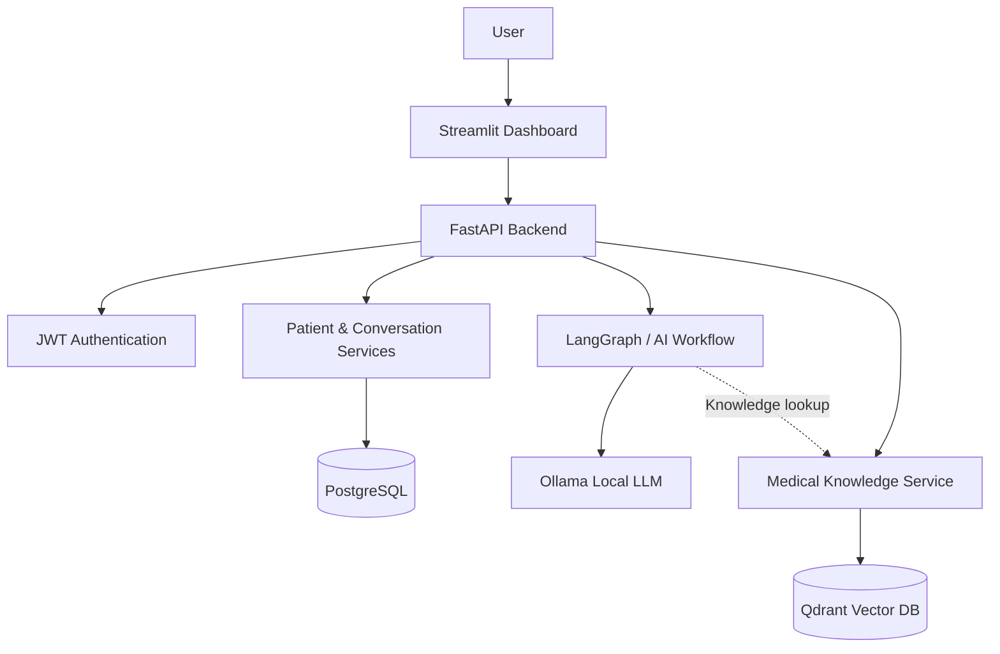

# 🩺 Dr AI Agent
### An AI-Powered Medical Knowledge & Patient Conversation Platform

**Dr AI Agent** brings medical information assistance, patient-linked conversations, and document-based knowledge search into one application. It combines a local large language model with a secure API, persistent conversation storage, and an interactive dashboard.

**Built with:** Python · FastAPI · Streamlit · LangGraph · Ollama · PostgreSQL · Qdrant · Docker

---

## 🎯 Objective

Build an intelligent healthcare-oriented assistant that can answer general medical questions, organize conversations by patient, preserve chat history, and provide a foundation for searching medical reference documents.

## 🏥 Business Problem

Medical information is spread across documents and websites, while many basic chatbots treat each interaction as a one-off conversation. This makes it harder to revisit discussions, organize information by patient, and connect answers with a searchable knowledge base.

## 💡 The Solution

Dr AI Agent provides a single workspace where users can:

- **Ask medical questions** in natural language and receive AI-generated explanations.
- **Create and select patient profiles** to organize interactions.
- **Start separate chat sessions** without losing previously saved discussions.
- **Reopen past conversations** with their stored questions and responses.
- **Access a medical knowledge workspace** for document upload and search.
- **Use an authenticated dashboard** backed by REST APIs and databases.

### Example User Journey

`Log in → Select patient → Ask a question → Receive AI response → Save conversation → Start a new chat → Reopen previous chat`

---

## ✨ Core Capabilities

| Capability | What it does |
|---|---|
| **Medical AI Chat** | Answers general medical-information questions using a locally served LLM |
| **Patient Workspace** | Organizes chat interactions around patient records |
| **Persistent Chat History** | Stores messages and sessions in PostgreSQL and restores earlier conversations |
| **Medical Knowledge** | Provides document and search interfaces supported by a Qdrant-based knowledge architecture |
| **JWT Authentication** | Protects authenticated application workflows |
| **Interactive Dashboard** | Offers AI Chat, Medical Knowledge, Dashboard, and System Status views |
| **REST API** | Exposes services for authentication, patients, chat, history, knowledge, and health checks |

## 🏗️ How It Works



**In simple terms:** Streamlit is the user interface, FastAPI handles application requests, Ollama runs the AI model, PostgreSQL keeps patient-linked chat records, and Qdrant supports the medical knowledge retrieval architecture.

## 🛠️ Technology Stack

| Layer | Technology |
|---|---|
| Frontend | Streamlit |
| Backend | FastAPI, Python, Pydantic |
| AI Orchestration | LangGraph |
| Local LLM | Ollama |
| Relational Database | PostgreSQL |
| Vector Database | Qdrant |
| Authentication | JWT |
| Infrastructure | Docker Compose |

---

## 🧪 Example Interaction

**User:** What is diabetes?

**Dr AI Agent:** Explains diabetes in general, educational language.

The conversation is associated with a selected patient and a session ID. The user can start a new chat and later reopen the saved conversation from **Previous Conversations**.

## 🔌 API Overview

The FastAPI backend exposes routes including:

| Area | API |
|---|---|
| Authentication | `/auth/login`, `/auth/refresh`, `/auth/me` |
| Patients | `/patients/`, `/patients/{patient_id}` |
| AI Chat | `POST /chat/` |
| Conversation History | `GET /patients/{patient_id}/history` |
| Session Messages | `GET /patients/{patient_id}/history/{session_id}` |
| Medical Knowledge | `/knowledge/documents`, `/knowledge/search` |
| Health | `/health`, `/health/db` |
| Voice APIs | `/voice/transcribe`, `/voice/speak` |

Interactive API documentation is available locally at **http://127.0.0.1:8000/docs**.

---

## 🚀 Run Locally

**Requirements:** Python, Docker Desktop / Docker Compose, and Ollama with the model configured for this project.

1. Open the project folder and configure your local environment variables and secrets.
2. Start the configured services:

   ```powershell
   docker compose up -d
   ```

3. Start the Streamlit interface:

   ```powershell
   python -m streamlit run streamlit_app.py
   ```

4. Open **http://localhost:8501**.

The backend is expected at **http://127.0.0.1:8000** in the local development setup. Install the project's Python dependencies from its actual dependency manifest before running.

> **Security:** Never commit `.env` files, JWT secrets, database passwords, real patient records, or private medical documents to GitHub.

---

## 💼 Engineering Value

This project demonstrates how to integrate **GenAI, API engineering, authentication, relational storage, vector-search infrastructure, and an interactive frontend** into a cohesive application—not just a standalone chatbot.

Its modular architecture can be extended for richer knowledge retrieval, improved patient workflows, deployment automation, and stronger operational controls.

## ⚕️ Responsible Use

Dr AI Agent is a **software engineering and educational project**, not a clinically validated medical device. Its responses are informational and must not replace diagnosis, treatment, prescriptions, emergency services, or advice from qualified healthcare professionals. Use fictional test-patient data for demonstrations.

---

**Dr AI Agent — Bringing AI conversations, patient context, and medical knowledge together.**
